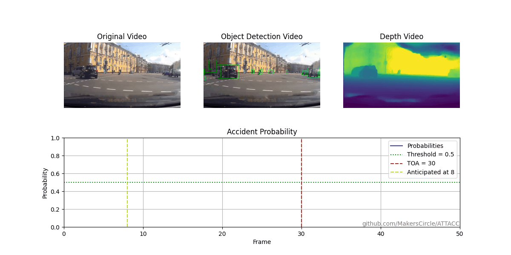

# ATTACC: Attention Based Accident Anticipation
## A Monocular Depth Enhanced Approach

ATTACC is an attention-based accident anticipation system for dashcam-style driving videos. It processes each frame with an object detector and a monocular depth estimator, then fuses the object-centric appearance features with their estimated 3D layout. A graph/transformer core attends over traffic participants and their interactions across time to predict, for every frame, the probability that an accident will occur in the near future. This multi-modal design helps the model focus on high-risk agents and improves early anticipation. The current implementation targets the CCD dataset and is trained with an uncertainty-guided loss (TUGL).





## Tech stack and project status
- Language: Python (>= 3.10)
- Package manager: Poetry (pyproject.toml with package-mode disabled)
- Deep learning: PyTorch 2.5.x, torchvision, torchaudio
- GNN: torch-geometric
- Computer vision: OpenCV, matplotlib
- Utilities: numpy, tqdm, scikit-learn
- Optional: CUDA (11.8/12.1/12.4 supported via conda channels in the commands below)

Note: There is no CLI entry point defined in pyproject.toml. Scripts are run as Python modules or by executing files directly. Some paths and hyperparameters are currently hard-coded in scripts.

## Requirements
- Python 3.10+
- Conda (recommended) for managing the PyTorch + CUDA stack
- Poetry for dependency management (package-mode=false; deps are pinned in poetry.lock)
- ffmpeg installed on your system (required by matplotlib FFMpegWriter for demo rendering)
- GPU with CUDA (optional but recommended). CPU-only is supported with lower performance.


## Environment setup
Follow the steps below to set up the project environment exactly as configured.

### 1) Create and activate Conda environment
```sh
conda create -n attacc python=3.10
conda activate attacc
```

Note: PyTorch announced that version 2.5 will be the last release published to the pytorch channel on Anaconda.

### 2) Install PyTorch

macOS (CPU):
```sh
conda install pytorch==2.5.1 torchvision==0.20.1 torchaudio==2.5.1 -c pytorch
```

Linux/Windows (choose your CUDA):

CUDA 11.8
```sh
conda install pytorch==2.5.1 torchvision==0.20.1 torchaudio==2.5.1 pytorch-cuda=11.8 -c pytorch -c nvidia
```

CUDA 12.1
```sh
conda install pytorch==2.5.1 torchvision==0.20.1 torchaudio==2.5.1 pytorch-cuda=12.1 -c pytorch -c nvidia
```

CUDA 12.4
```sh
conda install pytorch==2.5.1 torchvision==0.20.1 torchaudio==2.5.1 pytorch-cuda=12.4 -c pytorch -c nvidia
```

CPU only
```sh
conda install pytorch==2.5.1 torchvision==0.20.1 torchaudio==2.5.1 cpuonly -c pytorch
```

### 3) Install Poetry
```sh
pip install poetry
```

### 4) Install project dependencies via Poetry
This uses the existing pyproject.toml and poetry.lock.
```sh
poetry install
```

### 5) Install timm separately (to avoid upgrading PyTorch)
```sh
pip install timm==0.6.12
```


## Project structure
High-level directories of this repository:

- data/
  - datasets/ccd/
  - preprocessing/
- models/
  - architecture/
  - saved_models/
- outputs/
  - training/
  - testing/
- demo/
- logs/
- visualization/
- pyproject.toml, poetry.lock


## Notes and troubleshooting
- torch-geometric may require a PyTorch build that matches your CUDA runtime; if you hit install/runtime errors, verify the PyTorch/CUDA pairing and consult torch-geometric install docs.
- If matplotlib animation raises an ffmpeg error, ensure ffmpeg is installed and on PATH (see setup step 6).
- Some dataset and feature paths are currently hard-coded for CCD; adapt as needed.


## TODO
- add argparse to trainer/evaluator/preprocess to make CLI usage consistent and configurable.
- add argparse-based CLIs and [project.scripts] entry points.
- Add citation information and license

